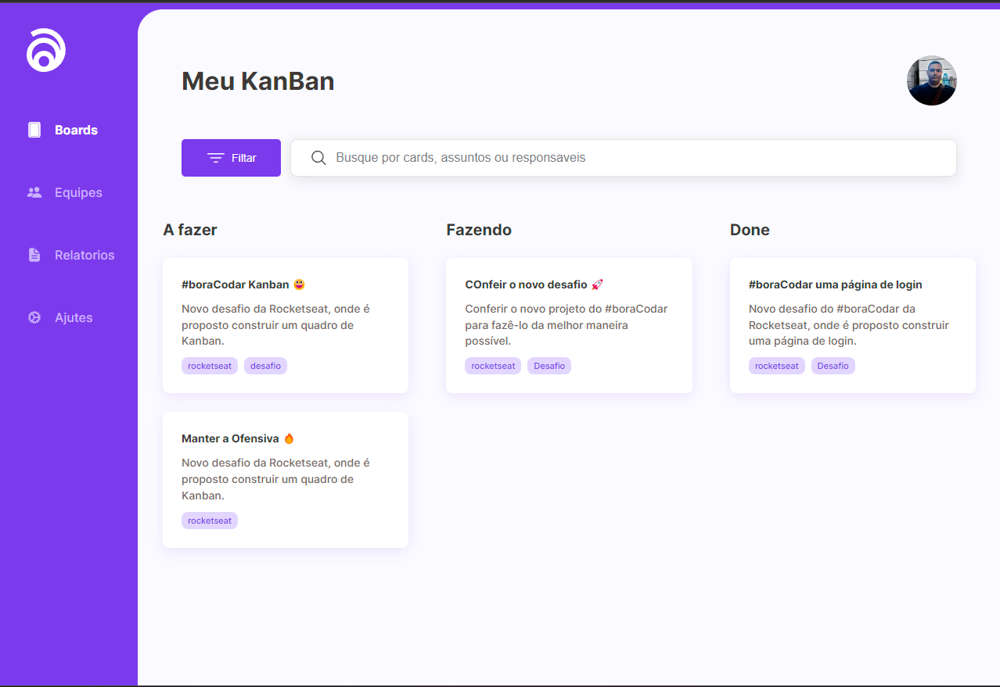

<h1 align="center"> Layout Quadro Kanban </h1>

Aprendendo A Fazer um Layout Quadro Kanaban.  

  <a href="#-Tech">Techs</a>&nbsp;&nbsp;&nbsp;|&nbsp;&nbsp;&nbsp;
  <a href="#-projeto">Project</a>&nbsp;&nbsp;&nbsp;

 

## 🧭 Tecnologias

Este projeto foi desenvolvido com as seguintes tecnologias:

### Front-end

- `HTML`
- `CSS`

## 💻 Projeto

Aprendendo um pouco de Layout... Projeto feito inicial para implementar funcionalidades...

 

## 💻 Para inclementar

• Como cortar textos longos e adicionar 3 pontinhos com CSS e Javascript
• Drag and Drop Raiz com a API do html, css e javascriptro masterClass #16

Feito com ♥ by Maykon
