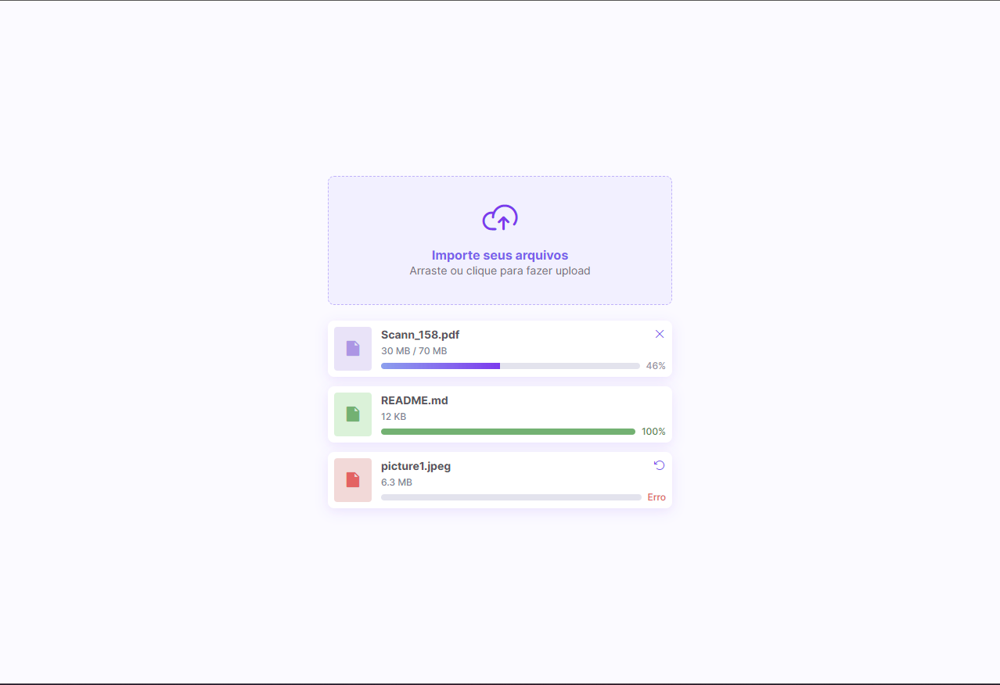

<h1 align="center"> Layout Para Importar Aquivos </h1>

Aprendendo A Fazer um Layout para importar arquivos.  

  <a href="#-Tech">Techs</a>&nbsp;&nbsp;&nbsp;|&nbsp;&nbsp;&nbsp;
  <a href="#-projeto">Project</a>&nbsp;&nbsp;&nbsp;

 

## 🧭 Tecnologias

Este projeto foi desenvolvido com as seguintes tecnologias:

### Front-end

- `HTML`
- `CSS`
- `Javascript`

## 💻 Projeto

Aprendendo um pouco de Layout... Projeto feito inicial para implementar funcionalidades...

 

## 💻 Para inclementar

• Adicionar a função para as barras de progressos..
• Criar as funcionalidades

Feito com ♥ by Maykon
